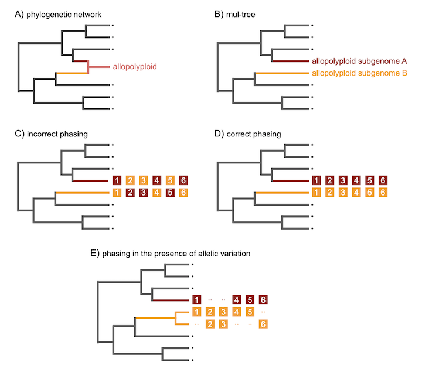
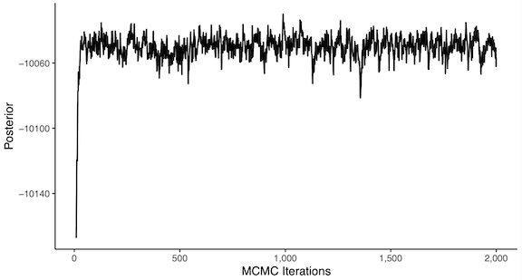
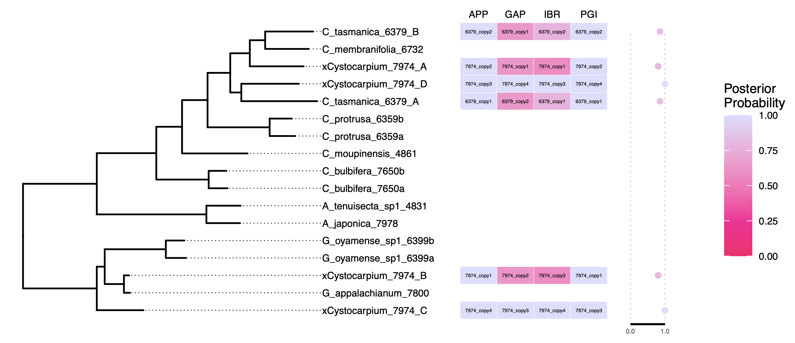

# Phasing gene copies into polyploid subgenomes using `homologizer`

*Will Freyman (willfreyman@gmail.com)*  
*Carl Rothfels (crothfels@berkeley.edu)*

This tutorial describes the usage of `homologizer` to phase gene copies into 
polyploid subgenomes.
The tutorial is an abbreviated version of a soon-to-be published paper in Methods in Molecular Biology.
Please see that paper for many more details and practical considerations for running `homologizer` analyses.
If you use `homologizer`, please cite the paper in which we first describe the method:

- Freyman, W.A., Johnson, M.G., and C.J. Rothfels. 2020. Homologizer: phylogenetic phasing of gene copies into polyploid subgenomes. *bioRxiv*

`homologizer` is implemented in `RevBayes`. Please see [http://revbayes.com](http://revbayes.com) to download and install `RevBayes`. 
For users without previous `RevBayes` experience, we recommend the tutorials at [http://revbayes.com](http://revbayes.com).

## Introduction


The first analysis described below uses `homologizer`
to phase gene copies into the subgenomes of a set of allopolyploids.
The second example analysis uses `homologizer` to test whether the observed
gene copies of one of the allopolyploids are homeologs from distinct
subgenomes or allelic variants arising from the same subgenome.
We provide the [data](http://github.com/wf8/homologizer/data) and the full [scripts](http://github.com/wf8/homologizer/src) 
required to run these examples in the repo at
[http://github.com/wf8/homologizer/](http://github.com/wf8/homologizer/). 

### The `homologizer` model


 
 The `homologizer` model phases gene copies into polyploid subgenomes over a mul-tree,
 as illustrated in the image above.
*Panel A*: A phylogenetic network with a single
    a single hybridization (reticulation) giving rise to an allopolyploid.
*Panel B*: The mul-tree representation of the phylogenetic network
has two tips (red and orange) representing the two subgenomes of the allopolyploid.
*Panel C*: Six loci were sequenced from
    the allopolyploid (red and orange squares). 
    Two copies (red and orange) of each locus were recovered.
Loci 2, 3, and 5 are incorrectly phased; that is they are
incorrectly assigned to the wrong subgenome.
*Panel D*: After phasing, the gene copies of each locus
are now assigned to the correct subgenome.
*Panel E*: An alternative phasing model allows for the two gene copies to be allelic variants
from the same subgenome.
In this example, both copies of locus 2 and 3 are allelic variants from the orange subgenome and no copies of these loci were 
recovered from the red subgenome.


## Tutorial: phasing gene copies

Our first example analysis uses `homologizer`
to phase gene copies into the subgenomes of a set of allopolyploids.
The output of the analysis is the posterior distribution of phased homeologs, 
i.e., the posterior distribution of the assignments of each gene copy, 
for each locus, into each of the subgenomes of the polyploids. Since we perform 
joint inference of the phasing and phylogeny, the posterior distribution of the 
multi-locus phylogeny is also inferred, along with all other parameters of the model.


In this example analysis we use a reduced version of the dataset from the fern family 
Cystopteridaceae previously
analyzed in Rothfels et. al (2017) and Freyman et. al (2020) (reduced to increase the speed of the analyses).
The data consist of four single-copy nuclear loci 
(*ApPEFP_C, gapCpSh, IBR3*, and *pgiC*) 
for a sample of 11 diploids and two tetraploids. 

Here we gloss over many of the details in the phylogenetic model
(e.g., substitution models)
so that we can focus on the phasing aspect of the analysis.
Detailed tutorials on these other aspects of `RevBayes` can be found at [http://revbayes.com](http://revbayes.com).

### Setting up the analysis

Below we'll step through the code for this analysis line by line. However, if you have downloaded the data and script from
the git repo [http://github.com/wf8/homologizer/](http://github.com/wf8/homologizer/)
you can run the full analysis by typing `rb src/cystopteridaceae.Rev` in your terminal window
from the `homologizer` directory.

Our first step is to define a vector that holds the input sequence 
alignment files, one for each locus.
```R
alignments = ["data/APP.nex",
              "data/GAP.nex",
              "data/IBR.nex",
              "data/PGI.nex"]
```
We'll now loop through and read in each alignment, saving
them to the vector `data`.
```R
num_loci = alignments.size()
for (i in 1:num_loci) {
    data[i] = readDiscreteCharacterData(alignments[i])
}
```
Next we set the *initial* phase assignments
for the polyploid accession `xCystocarpium_7974`.
We need to set the phase assignment here to enable the MCMC to initialize.
We can randomly assign gene copies to subgenomes; the assignment 
should not affect the final outcome of the analysis assuming the MCMC
is allowed to converge.

We do this by calling the function `setHomeologPhase`
on each of the alignments. In the alignments the sequences for this
accession are named `7974_copy1` through `7974_copy4`.
We wish to phase those copies among four mul-tree tips, 
`xCystocarpium_7974_A` through `xCystocarpium_7974_D`.
```R
for (i in 1:num_loci) {
    data[i].setHomeologPhase("7974_copy1", "xCystocarpium_7974_A")
    data[i].setHomeologPhase("7974_copy2", "xCystocarpium_7974_B")
    data[i].setHomeologPhase("7974_copy3", "xCystocarpium_7974_C")
    data[i].setHomeologPhase("7974_copy4", "xCystocarpium_7974_D")
}
```
This data set contains a second polyploid `C_tasmanica_6379`.
This accession, though, only has two subgenomes and two gene copies of each locus.
However, it is missing a sequence for the gene IBR; 
for IBR there is only a single copy: `6379_copy1`.
Recalling that IBR is the third sequence alignment we read in,
we can add a blank second IBR gene copy for `C_tasmanica_6379`:
```R
data[3].addMissingTaxa("6379_copy2")
``` 
Now we again loop through the alignments, this time setting the initial phase
for `C_tasmanica_6379`.
```R
for (i in 1:num_loci) {
    data[i].setHomeologPhase("6379_copy1", "C_tasmanica_6379_A")
    data[i].setHomeologPhase("6379_copy2", "C_tasmanica_6379_B")
}
```
The next few sections of code are fairly standard for `Rev` phylogenetic analyses,
and not unique to a `homologizer` analysis.
Since some of the diploid accessions are also missing sequences for some loci, we
now add any blank sequences needed so all the alignments contain all the accessions:
```R
for (i in 1:num_loci) {
    for (j in 1:num_loci) {
        data[i].addMissingTaxa(data[j].taxa())
    }
}
```
We'll need some useful information from the alignments:
```R
num_tips = data[1].ntaxa()
n_branches = 2 * num_tips - 3
```
Now create a vector of branch lengths. We'll draw each
branch length from an exponential distribution.
We'll also add MCMC scaling moves for each branch length (which we'll store in the `moves` vector, indexed by the `mvi` counter).
```R
mvi = 0
for (i in 1:n_branches) {
    branch_lengths[i] ~ dnExponential(10)
    moves[++mvi] = mvScale(branch_lengths[i], weight=1.0)
}
``` 
We'll use a uniform topology prior that
puts equal probability on all unrooted, fully resolved topologies.
Additionally, we'll add MCMC moves for the topology,
the nearest-neighbor interchange (NNI)
and subtree pruning and regrafting (SPR) tree arrangment moves.
```R
topology ~ dnUniformTopology(data[1].taxa())
moves[++mvi] = mvNNI(topology, weight=40.0)
moves[++mvi] = mvSPR(topology, weight=40.0)
```
Finally, we combine the topology and the branch length vector into a deterministic node
that represents our phylogeny:
```R
tree := treeAssembly(topology, branch_lengths)
```
For the nucleotide substitution models we will specify a general time-reversible (GTR)
model for each locus. 
We will use an uninformative Dirichlet distribution as prior on the stationary
frequencies (`pi`), and for the 
six exchangeability rates `er`.
To estimate `pi` and `er` we use the MCMC move
`mvSimplexElementScale`, which randomly changes one element of the simplex
and then rescales the other elements so that they sum to one again.
For each locus we construct the GTR rate matrix `Q` using the function `fnGTR`
which puts together `pi` and `er`.
```R
for (i in 1:num_loci) {

    er_prior <- v(1,1,1,1,1,1)
    er[i] ~ dnDirichlet(er_prior)
    er[i].setValue(simplex(v(1,1,1,1,1,1)))
    moves[++mvi] = mvSimplexElementScale(er[i], weight=5)

    pi_prior <- v(1,1,1,1)
    pi[i] ~ dnDirichlet(pi_prior)
    pi[i].setValue(simplex(v(1,1,1,1)))
    moves[++mvi] = mvSimplexElementScale(pi[i], weight=5)

    Q[i] := fnGTR(er[i], pi[i])
}
```
Additionally, we estimate a substitution rate multiplier for each of the alignments
except the first one.
We draw the rate multipliers from an exponential distribution:
```R
for (i in 1:num_loci) {
    if (i == 1) {
        rate_multiplier[i] <- 1.0
    } else {
        rate_multiplier[i] ~ dnExponential(1)
        moves[++mvi] = mvScale(rate_multiplier[i], weight=5)
    }
}
```
Our sequence evolution models are continuous-time Markov chains (CTMC) over
the phylogeny. So we pass a GTR rate matrices `Q`,
a `rate_multiplier`,
and the `tree` into a phylogenetic CTMC distribution, one for each locus.
We fix the value of the CTMC to our observed sequence data
using the `clamp` function.
```R
for (i in 1:num_loci) {
    ctmc[i] ~ dnPhyloCTMC(tree=tree, Q=Q[i], branchRates=rate_multiplier[i], type="DNA")
    ctmc[i].clamp(data[i])  
}
```
We now have fully defined our phylogenetic model, 
so we wrap it up and declare it complete:
```R
mymodel = model(Q)
```
To infer the phasing, though, we wish to add MCMC phasing proposals.
We use the function `mvHomeologPhase` to define a phasing proposal
that swaps the sequences between any two mul-tree tips for a given locus.
Since our polyploid accession `C_tasmanica_6379` has only 
two subgenomes A and B, we need one `mvHomeologPhase`
per locus:
```R
for (i in 1:num_loci) {
    moves[++mvi] = mvHomeologPhase(ctmc[i], "C_tasmanica_6379_A", "C_tasmanica_6379_B", weight=2)
}
```
Note that the `weight` of the move is set to 2. The weight specifies how often this particular MCMC move will be proposed relative to all
other moves in our MCMC. If the phasing analysis is not converging, 
one can try increasing the weight of these moves.

The other polyploid accession `xCystocarpium_7974` has four subgenomes.
To enable gene copies to swap among all four subgenomes we need
(4 choose 2) = 6 moves for each locus:
```R
for (i in 1:num_loci) {
    moves[++mvi] = mvHomeologPhase(ctmc[i], "xCystocarpium_7974_A", "xCystocarpium_7974_B", weight=2)
    moves[++mvi] = mvHomeologPhase(ctmc[i], "xCystocarpium_7974_A", "xCystocarpium_7974_C", weight=2)
    moves[++mvi] = mvHomeologPhase(ctmc[i], "xCystocarpium_7974_A", "xCystocarpium_7974_D", weight=2)
    moves[++mvi] = mvHomeologPhase(ctmc[i], "xCystocarpium_7974_B", "xCystocarpium_7974_C", weight=2)
    moves[++mvi] = mvHomeologPhase(ctmc[i], "xCystocarpium_7974_B", "xCystocarpium_7974_D", weight=2)
    moves[++mvi] = mvHomeologPhase(ctmc[i], "xCystocarpium_7974_C", "xCystocarpium_7974_D", weight=2)
}
```
Finally, we need to set up some monitors to
draw samples from the chain.
We'll set up three monitors used in standard phylogenetic analyses:
one that writes a log file for most of the model parameters, another that writes
the sampled trees to file, and also a screen monitor
so we can view progress on our screen:
```R
mni = 0
output_file = "output/homologizer"
monitors[++mni] = mnModel(filename=output_file + ".log", printgen=1)
monitors[++mni] = mnFile(filename=output_file + ".trees", printgen=1, tree)
monitors[++mni] = mnScreen(printgen=1)
```
Additionally we need to define special monitors for logging samples of the phase
of each locus. These are defined using `mnHomeologPhase`. We
must specify one of these for each of the loci being phased.
```R
for (i in 1:num_loci){
    log_file = output_file + "_locus_" + i + "_phase.log"
    monitors[++mni] = mnHomeologPhase(filename=log_file, printgen=1, ctmc[i])
}
```

### Running the MCMC


Finally, let's set up our MCMC object and run it.
To do this, we pass our model object `mymodel`,
the vector of monitors, and the vector of MCMC moves into the `mcmc` function.
For this example exercise we'll run the analysis for 2000 iterations.
 For an actual analysis the MCMC should be run much longer.
```R
mymcmc = mcmc(mymodel, monitors, moves)
mymcmc.run(generations=2000)
```
This will execute the analysis and you should see output similar to this:
```R
   Running MCMC simulation
   This simulation runs 1 independent replicate.
   The simulator uses 73 different moves in a random move schedule with 219.8 
   moves per iteration

Iter   |   Posterior   |  Likelihood   |     Prior   |    elapsed   |        ETA   |
------------------------------------------------------------------------------------
0      |    -14739.8   |      -14848   |   108.217   |   00:00:00   |   --:--:--   |
1      |    -11255.8   |    -11363.8   |   107.962   |   00:00:01   |   --:--:--   |
2      |    -10664.5   |    -10773.7   |   109.236   |   00:00:01   |   00:16:39   |
3      |    -10440.4   |    -10550.9   |   110.498   |   00:00:01   |   00:11:05   |
4      |    -10405.3   |    -10515.3   |   110.053   |   00:00:02   |   00:08:38   |
...
```
When the analysis is complete, you will have a new directory called `output` that will contain all of the files you specified with the monitors.
To check whether the MCMC has converged we can plot the trace of the model parameters
found in `output/homologizer.log`.
To further assess convergence, this file can be opened in 
[Tracer](https://github.com/beast-dev/tracer) or analyzed using the `R` package [CODA](https://cran.r-project.org/web/packages/coda/index.html).



In the trace shown above, the MCMC appears to converge after approximately 100 iterations.
 For an actual analysis the MCMC should be run much longer.


### Summarizing the posterior distribution


The inferred phasing of gene copies into subgenomes is best summarized in
the context of the phylogeny (see figure below).
So our first step is to summarize the trees sampled by the MCMC.
We read in the tree samples:
```R
treetrace = readTreeTrace(output_file + ".trees", treetype="non-clock", burnin=0.25) 
```
and summarize the trees into a single
maximum *a posteriori* (MAP) tree:
```R
map_tree = mapTree(treetrace, output_file + "_map.tree")
```
This command creates the tree file 
`output/homologizer_map.tree` that you can plot in [APE](https://cran.r-project.org/web/packages/ape/index.html) 
or [FigTree](http://tree.bio.ed.ac.uk/software/figtree/).
Since we estimated an unrooted tree, you should use one of these tools
to root the tree correctly and save a copy of the rooted tree that
we can use to visualize the inferred phasing.

Once we have the rooted MAP tree, the phasing
estimates can be summarized and plotted
using `R`. 
For this tutorial we provide a script `src/plot_phase.R`
to generate the figure below.
After running the MCMC, if you have downloaded the data and scripts from
the git repo [http://github.com/wf8/homologizer/](http://github.com/wf8/homologizer/)
you can run the plotting script by typing `Rscript src/plot_phase.R` in your terminal window
from the `homologizer` directory.
This script can be easily adapted to work for other datasets; see the comments within the script.
This plotting functionality will soon be more widely available as part of the 
`RevGadgets` package (Tribble et al. 2021).



 Shown above is the inferred phasing of gene copies into subgenomes summarized on the MAP phylogeny for the Cystopteridaceae dataset.
 The phase is estimated for the two polyploid accessions 
  `xCystocarpium_7974` and `C_tasmanica_6379`.
 To the right of the tree, each column represents a locus, 
        and the joint MAP phase assignment is shown as text within each box.
 Each box is colored by the marginal posterior probability of the phase assignment.
These marginal posterior probabilities are useful to quantify the 
uncertainty within the joint MAP phasing assignment.
For example, it may be that the joint MAP phase of a given polyploid has a low marginal
posterior probability in some subgenomes 
but a high marginal posterior probability in other subgenomes.
 Adjacent to the heatmap is a column that shows the mean marginal probability across loci of the phasing assignment per tip, which summarizes the model's overall confidence in the phasing of that tip.


## Tutorial: Comparing phasing models to distinguish homeologs from allelic variation

To distinguish gene copies that evolved in separate
polyploid subgenomes from those that 
arose from allelic variation within the same subgenome 
(or that are otherwise non-homeologous),
one can set up a series of different `homologizer` model that differ in the number 
of mul-tree tips available to phase.
The statistical fit of these models can then be compared using Bayes factors.

Consider the example from the figure in the introduction above. 
In panel D the allopolyploid has two subgenomes (red and orange).
Two copies of six loci are correctly phased into the two subgenomes.
However, in panel E, both copies of loci two and three are actually
allelic variants from the orange subgenome, and no copies
of these loci were recovered from the red subgenome.
In real datasets it can be hard to distinguish between these two scenarios.
With `homologizer`, however, the researcher can set up two models: one that allows phasing 
among two mul-tree tips for the allopolyploid, and another that allows phasing
among three mul-tree tips.
Bayes factors are then used to compare to two models and determine how many tips
should be used.

For our second example analysis, we will return to the
Cystopteridaceae dataset 
and test whether the polyploid accession `C_tasmanica_6379`
should be phased into two mul-tree tips (as done in tutorial 1 above)
or whether allelic variation is present and 
three mul-tree tips are needed for phasing.

### Computing marginal likelihoods

To compare the two mul-tree tip and three mul-tree tip `homologizer` phasing models
using Bayes factors, we first need to ensure that
the data used under both models are the same.
For example, when adding a third tip for the 
polyploid accession `C_tasmanica_6379`,
we'll add a new set of blank sequences to this tip,
so this set of blank sequences 
needs to be added to both models (the two mul-tree tip and three mul-tree tip phasing models).
However, only in the three-tip model will we allow gene copies
to be phased into this third tip (in the two-tip model the third tip will exist, but will only be associated with blank sequences).
The code from our first example above specifies the two-tip phasing model.
To add the third blank tip, we need to modify the code where we set the
initial phase of each gene copy to:
```R
for (i in 1:num_loci) {
    data[i].setHomeologPhase("6379_copy1", "C_tasmanica_6379_A")
    data[i].setHomeologPhase("6379_copy2", "C_tasmanica_6379_B")
    data[i].addMissingTaxa("6379_BLANK")
    data[i].setHomeologPhase("6379_BLANK", "C_tasmanica_6379_C")
}
```
This code adds a blank sequence (which we've labeled `6379_BLANK`) to each locus, 
and associates those blank sequences with a mul-tree tip called `C_tasmanica_6379_C`.
Since we have not created any moves associated with this third tip (there's no associated `mvHomeologPhase` command), no gene copies will be phased into it.
To ease the interpretation of the results after phasing, we recommend that the names for blank sequences include 
"BLANK", e.g., `6379_BLANK` or `6379_BLANK1` and `6379_BLANK2` if a locus is missing more than one sequence. 

For the Bayes factors, we will compute the marginal
likelihood of each model using a stepping-stone analysis.
To do so for the two-tip phasing model that we now have in hand, 
we can simply swap out this section of code:
```R
mymcmc = mcmc(mymodel, monitors, moves)
mymcmc.run(generations=2000)
```
for this section of code:
```R
pow_p = powerPosterior(mymodel, moves, monitors, output_file + ".out", 
                       cats=50, sampleFreq=1) 
pow_p.burnin(generations=200, tuningInterval=50)
pow_p.run(generations=1000)  
ss = steppingStoneSampler(file=output_file + ".out", 
                          powerColumnName="power", likelihoodColumnName="likelihood")
print(ss.marginal())
```
This code sets up the stepping-stone sampler that uses 50 stepping stones, 
sampling 1000 states from each step.
Once it is complete, the code prints the marginal likelihood to the screen.
When run, it looks like this:
```R
Running burn-in phase of Power Posterior sampler for 200 iterations.
The simulator uses 72 different moves in a random move schedule with 222 moves per iteration


Progress:
0---------------25---------------50---------------75--------------100
********************************************************************


Running power posterior analysis ...
Step  1 / 51            ****************************************
Step  2 / 51            ****************************************
Step  3 / 51            ****************************************
...
Step 49 / 51            ****************************************
Step 50 / 51            ****************************************
Step 51 / 51            ****************************************
-10313.19
```
The final number (`-10313.19`) is the log marginal likelihood
of the two-tip `homologizer` phasing model.

### Setting up the alternative `homologizer` model

We can now modify the two-tip phasing model specified above so that it allows
phasing among all three mul-tree tips.
We will change the code where we define
the MCMC proposals that allow different phasing assignments to be explored.
Previously, since `C_tasmanica_6379` only had two mul-tree tips to phase among,
a single `mvHomeologPhase` per locus was sufficient:
```R
for (i in 1:4) {
    moves[++mvi] = mvHomeologPhase(ctmc[i], "C_tasmanica_6379_A", "C_tasmanica_6379_B", weight=2)
}
```
Now the above code must be changed to:
```R
for (i in 1:4) {
    moves[++mvi] = mvHomeologPhase(ctmc[i], "C_tasmanica_6379_A", "C_tasmanica_6379_B", weight=2)
    moves[++mvi] = mvHomeologPhase(ctmc[i], "C_tasmanica_6379_A", "C_tasmanica_6379_C", weight=2)
    moves[++mvi] = mvHomeologPhase(ctmc[i], "C_tasmanica_6379_B", "C_tasmanica_6379_C", weight=2)
}
```
Now we can compute the marginal likelihood of the three-tip model
using a stepping-stone analysis just as we did for the two-tip model: this analysis results in a marginal likelihood calculation of `-10244.20`.

### Comparing the two `homologizer` models

Bayes factors are the ratio of the marginal likelihoods of the two
models being compared. 
In this case, we have computed -10244.2 for the three mul-tree tip phasing model
and -10313.19 for the two mul-tree tip phasing model.
Since these are log marginal likelihoods, we subtract them to compute the Bayes factor: -10244.2 - (-10313.19) = 68.99.
Here, the Bayes factor of the three mul-tree tip model 
compared to the two mul-tree tip
model is 68.99, which is *strong* support for the three-tip model (Kass and Raftery, 1995).
Note that if you run this example your marginal likelihood estimates may differ
slightly.
The marginal likelihoods will converge more closely if we ran longer stepping-stone analyses, for example increasing the number of states sampled from each stone to 5000 rather than 1000.


This ability to use `homologizer` as a data-exploration and hypothesis testing tool may result
in key insights about the polyploid accession that can significantly
impact downstream interpretations.
In this example,
the three-tip model strongly out-performed the two-tip model for the polyploid
`C_tasmanica_6379`.
Indeed, in Freyman et al. (2020) we use `homologizer` to show that
the two *gapCpSh* copies from this polyploid are allelic variants from the same
subgenome (sister to one another in the phylogeny), 
with a blank copy phased with high posterior probability to the other subgenome. 
Recognizing these copies as alleles rather than homeologs resulted in significantly altered downstream inferences about the evolutionary history of this species, including very different inferences of its parentage.


## References

- Freyman, W. A., M. G. Johnson, and C. J. Rothfels. 2020. Homologizer: phylogenetic phasing of gene copies into polyploid subgenomes. *bioRxiv*
- Kass, R. E. and A. E. Raftery. 1995. Bayes factors. *Journal of the American Statistical Association* 90:773–795
- Rothfels, C. J., K. Pryer, and F.-W. Li. 2017. Next-generation polyploid phylogenetics: rapid resolution of hybrid polyploid complexes using PacBio single-molecule sequencing. *New Phytologist* 213.
- Tribble, C.M., Freyman, W.A., Landis, M.J., Lim, J.Y., Barido-Sottani, J., Kopperud, B.T., Höhna, S., and M.R. May. 2021. RevGadgets: an R Package for visualizing Bayesian phylogenetic analyses from RevBayes. *bioRxiv*
